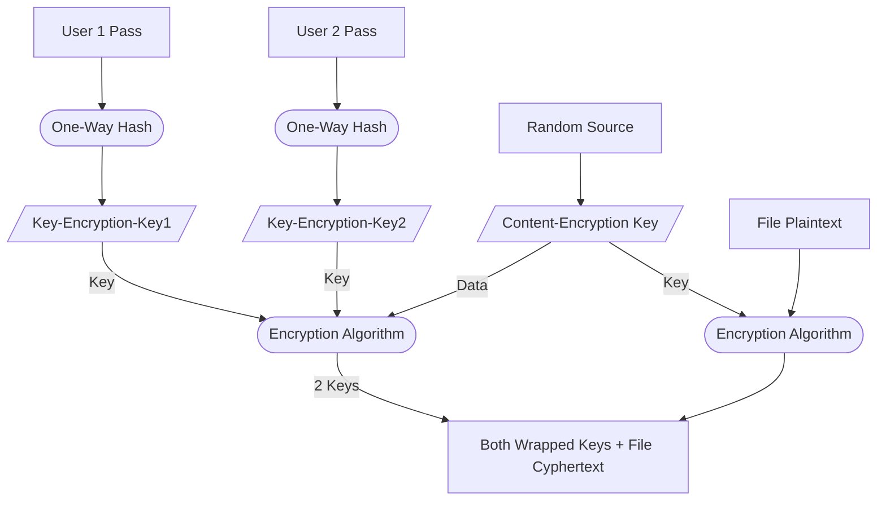
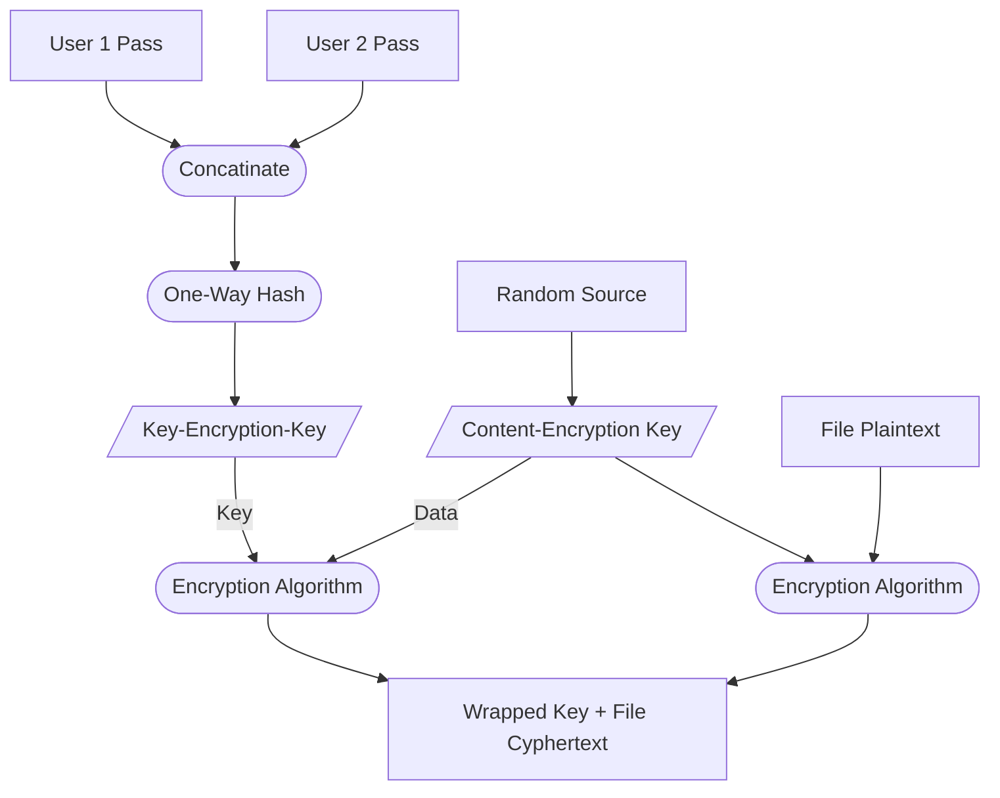

```mermaid
graph TD
    OWH1([One-Way Hash])
    OWH2([One-Way Hash])
    TP[User 1 Pass]
    tp[User 2 Pass]
    KEK1[/Key-Encryption-Key1/]
    KEK2[/Key-Encryption-Key2/]
    RS[Random Source]
    CEK[/Content-Encryption Key/]
    EA([Encryption Algorithm])
    ea([Encryption Algorithm])
    FPT[File Plaintext]
    WKFCT[Both Wrapped Keys + File Cyphertext]
    
    TP --> OWH1
    tp --> OWH2
    OWH1 -->KEK1
    OWH2 -->KEK2
    RS --> CEK
    KEK1 & KEK2 -->|Key|EA
    CEK -->|Data|EA
    CEK -->|Key|ea
    FPT -->ea
    EA -->|2 Keys| WKFCT
    ea --> WKFCT
```

```mermaid
graph TD
    TP[User 1 Pass]
    tp[User 2 Pass]
    C([Concatinate])
    OWH([One-Way Hash])
    KEK[/Key-Encryption-Key/]
    RS[Random Source]
    CEK[/Content-Encryption Key/]
    EA([Encryption Algorithm])
    ea([Encryption Algorithm])
    FPT[File Plaintext]
    WKFCT[Wrapped Key + File Cyphertext]
    
    TP & tp --> C
    C --> OWH
    OWH -->KEK
    RS --> CEK
    KEK -->|Key|EA
    CEK -->|Data|EA
    CEK & FPT -->ea
    EA & ea --> WKFCT
```